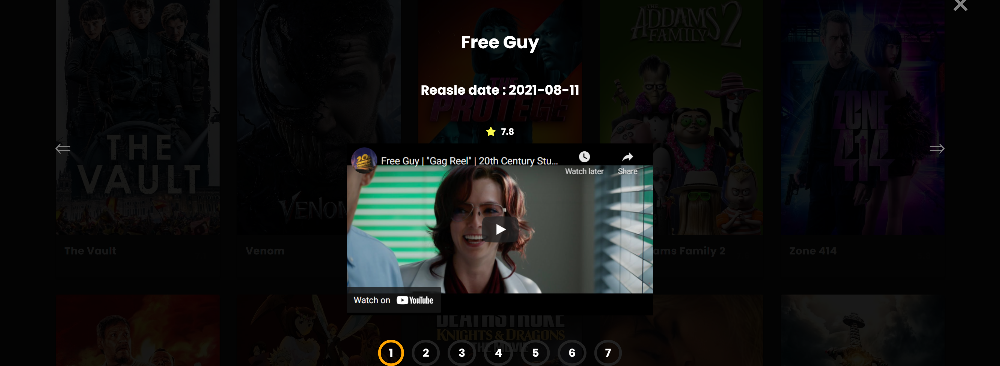

# Watch iT!

  

 

## Our this website got 1st prize in MindSpark 2021 Web Design Event.🎉🙌

MindSpark is the annual, national level technical festival of College of Engineering, Pune.
Over a span of 14 years, MindSpark has grown to become one of the biggest technical college fests in the country.

## Team

- [@Sumit Vajarinkar](https://github.com/sumitvajarinkar)
- [@Jaydeep Shelake](https://github.com/jaydeep-shelake)

>Track 3 – Entertainment and Media  
>Movies/TV Shows Website built using HTML ,CSS, JS and API  
> Website made for MindSpark (COEP) Web Design event 

## ⚙️ Detailed Functionality
* Theme is about Entertainment and Media.
* Theme is about Entertainment and Media so we have focused on Movies/TV shows.
* Landing page gives all the info about search, filter movies by types, etc.
* User can filter out the movies from filter box. 
* User can search for movies in search box.
* User can navigate from from previous page to next page using JavaScript pagination.
* Movies provided with name, overview, duration, genre, reviews, ratings, photos, etc.
* By clicking on the movie it redirect towards its trailer.
* We have used APIs for app.
 
## 🚀 Tech and Tools Used

* HTML, CSS, Vanilla JavaScript, TMDB API
* VS code
* GitHub

## 📸 Screenshots

## Desktop View

 

## Mobile View

 

## Movie

 

### Deployment Link : https://sumitvajarinkar.github.io/WATCHit
